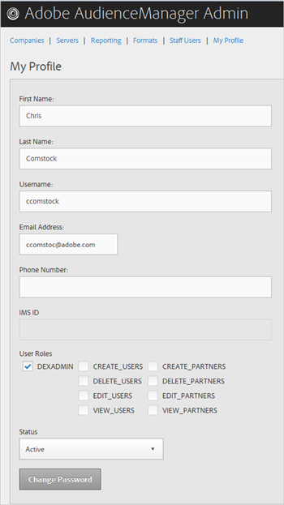
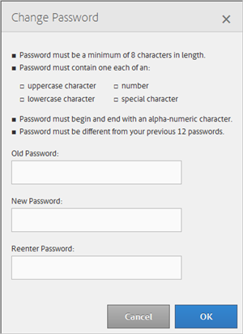

# 我的設定檔 {#my-profile}

編輯Audience Manager管理工具配置檔案的詳細資訊或更改密碼。

<!-- c_my_profile.xml -->

## 編輯配置檔案 {#edit-profile}

查看和編輯您的Audience Manager管理工具配置檔案，包括姓名、用戶名、電子郵件地址、電話號碼、 [!UICONTROL IMS ID]、用戶角色和狀態。

<!-- t_edit_profile.xml -->

1. 按一下 **[!UICONTROL My Profile]**.

   

2. 填寫欄位: 
   * **[!UICONTROL First Name]:** （必需）指定您的名字。
   * **[!UICONTROL Last Name]:** （必需）指定您的姓。
   * **[!UICONTROL Username]:** （必需）指定您的第一個用戶名。
   * **[!UICONTROL Email Address]:** （必需）指定您的電子郵件地址。
   * **[!UICONTROL Phone Number]:** 指定您的電話號碼。
   * **[!UICONTROL IMS ID]:** 指定Internet消息服務ID。
   * **[!UICONTROL User Roles]:** 選擇所需的用戶角色：
      * **[!UICONTROL DEXADMIN]:** 提供管理員訪問權限以在「Audience Manager管理」工具中執行任務。 如果未選擇此選項，則可以選擇單個角色。 這些角色允許用戶使用 [!DNL API] 呼叫，但不在管理工具中。
      * **[!UICONTROL CREATE_USERS]:** 允許用戶使用 [!DNL API] 呼叫。
      * **[!UICONTROL DELETE_USERS]:** 允許用戶使用 [!DNL API] 呼叫。
      * **[!UICONTROL EDIT_USERS]:** 允許用戶使用 [!DNL API] 呼叫。
      * **[!UICONTROL VIEW_USERS]:** 允許用戶使用 [!DNL API] 呼叫。
      * **[!UICONTROL CREATE_PARTNERS]:** 允許用戶使用 [!DNL API] 呼叫。
      * **[!UICONTROL DELETE_PARTNERS]:** 允許用戶使用 [!DNL API] 呼叫。
      * **[!UICONTROL EDIT_PARTNERS]:** 允許用戶使用 [!DNL API] 呼叫。
      * **[!UICONTROL VIEW_PARNTERS]:** 允許用戶使用 [!DNL API] 呼叫。
   * **[!UICONTROL Status]:** 選擇所需狀態：
      * **[!UICONTROL Active]:** 指定活動Audience Manager用戶中的此用戶。
      * **[!UICONTROL Deactivated]:** 指定此用戶是「受眾管理」中已停用的用戶。
      * **[!UICONTROL Expired]:** 指定此用戶在Audience Manager中的帳戶已過期。
      * **[!UICONTROL Locked Out]:** 指定鎖定此用戶在Audience Manager中的帳戶。
3. 按一下 **[!UICONTROL Submit]**.

## 更改密碼 {#change-password}

更改Audience Manager管理工具密碼。

<!-- t_change_password.xml -->

1. 按一下 **[!UICONTROL My Profile]**.
1. 按一下 **[!UICONTROL Change Password]**.

   

   您的Audience Manager密碼必須是：

   * 長度至少為8個字元；
   * 至少包含一個大寫字元；
   * 至少包含一個小寫字元；
   * 至少包含一個數字；
   * 至少包含一個特殊字元；
   * 以字母數字字元開頭和結尾；
   * 以字母數字字元開頭和結尾。

1. 指定舊密碼。
1. 指定新密碼，然後確認新密碼。
1. 按一下 **[!UICONTROL OK]**.
