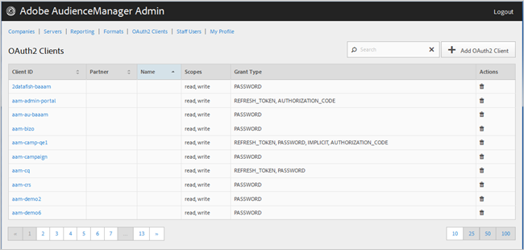

# OAuth2 用戶端 {#oauth-clients}

使用該 [!UICONTROL OAuth2 Clients] 頁可以查看配置中 [!UICONTROL OAuth2] 的客戶機列 [!DNL Audience Manager] 表。 您可以編輯或刪除現有客戶機或建立新客戶機，前提是您已分配了適當的用戶角色。

## 概述 {#overview}

<!-- c_oauth.xml -->

>[!NOTE]
>
>請確定您的客戶閱讀 [Audience Manager使用指南中](https://docs.adobe.com/content/help/en/audience-manager/user-guide/api-and-sdk-code/rest-apis/aam-api-getting-started.html#oauth) 的OAuth2檔案。

[!DNL OAuth2] 是授權的開放標準，代表資源擁有者提供對資 [!DNL Audience Manager] 源的安全委託存取。

您可以按一下所需欄的標題，以遞增或遞減順序來排序每個欄。

使用 [!UICONTROL Search] 清單底部的方塊或分頁控制項，以尋找所需的用戶端。

## 建立或編輯OAuth2用戶端 {#create-edit-client}

<!-- t_create_edit_auth.xml -->

使用Audience Manager工 [!UICONTROL OAuth2 Clients] 具中的頁面來 [!UICONTROL Admin] 建立新用戶端或 [!UICONTROL Oauth2] 編輯現有用戶端。

1. 若要建立新用戶 [!UICONTROL OAuth2] 端，請按一 **[!UICONTROL OAuth2 Clients]** 下> **[!UICONTROL Add OAuth2 Client]**。 若要編輯現有的 [!UICONTROL OAuth2] 用戶端，請在欄中按一下所要的 **[!UICONTROL Client ID]** 用戶端。
1. 指定此用戶端的所需 [!UICONTROL OAuth2] 名稱。 請注意，這僅是記錄的名稱。
1. 指定客 [!UICONTROL OAuth2] 戶端的電子郵件地址。 電子郵件地址的限制。
1. 從下拉 **[!UICONTROL Partner]** 式清單中，選擇所要的合作夥伴。
1. 在方塊 **[!UICONTROL Client ID]** 中，指定所要的ID。 這是提交請求時使用的 [!DNL API] 值。 在您從前一步驟的下拉式清單中選擇字詞後，開始 [!UICONTROL Partner] 輸入時，首碼會自動填入。 正確的格式為&lt; *`partner subdomain`*> - &lt; *`Audience Manager username`*>。
1. 視需要選取或 **[!UICONTROL Restrict to Partner Users]** 取消選取核取方塊。 如果選中此複選框，則用戶必須是所選 [!DNL Audience Manager] 夥伴的列出用戶。 建議您選取此選項作為最佳實務。
1. 在區段 **[!UICONTROL Scope]** 中，視需要選取或取 **[!UICONTROL Read]** 消 **[!UICONTROL Write]** 選取和核取方塊。
1. 在該部 **[!UICONTROL Grant Type]** 分中，選擇所需的授權方法。 建議您使用預設的設定和 [!UICONTROL Password] 選 [!UICONTROL Refresh-token] 項。

   * **[!UICONTROL Implicit]**:如果您選取此選項，則 [!UICONTROL Redirect URI] 會啟用方塊。 在經過驗證後，用戶被給予自動訪問令牌，並且立即被發送到重定向 [!DNL URI]。
   * **[!UICONTROL Authorization Code]**:如果您選取此選項，則 [!UICONTROL Redirect URI] 會啟用方塊。 在經過驗證後，用戶被返回到客戶端，然後被發送到重定向 [!DNL URI]。
   * **[!UICONTROL Password]**:使用用戶輸入的密碼來驗證用戶，而不是通過授權伺服器自動驗證嘗試。
   * **[!UICONTROL Refresh_token]**:用於在較長的時間內刷新過期的訪問令牌。

1. 在方 **[!UICONTROL Redirect URI]** 塊中，指定所要的 [!DNL URI]。 只有在您選取和授與類型時，才 **[!UICONTROL Implicit]** 會啟 **[!UICONTROL Authorization_code]** 用此選項。 此方 **[!UICONTROL Redirect URI]** 塊可讓您指定可接受值的逗號分隔 [!DNL URI] 值。 這是在 [!DNL URI] 批准用戶端進行存取後，會重新導向至用戶端的使 [!DNL API] 用者。
1. 指定存取和重新整理Token過期所需的過期時間（以秒為單位）。

   * **[!UICONTROL Access Token Expiration Time]**:存取Token在發出後有效的秒數。 使用平台預設值時可能為null（12小時）。 也可以是-1，以指出存取Token不會過期。
   * **[!UICONTROL Refresh Token Expiration Time]**:重新整理Token發出後有效的秒數。 使用平台預設值（30天）時可能為null。

1. 按一下 **[!UICONTROL Save]**.

若要刪除 [!UICONTROL OAuth2] 用戶端，請按 **[!UICONTROL OAuth2 Clients]**&#x200B;一下，然  後按一 **[!UICONTROL Actions]** 下所要用戶端的欄。

>[!MORELIKETHIS]
>
>* [API 需求與建議](../admin-oauth2/aam-admin-api-requirements.md)

