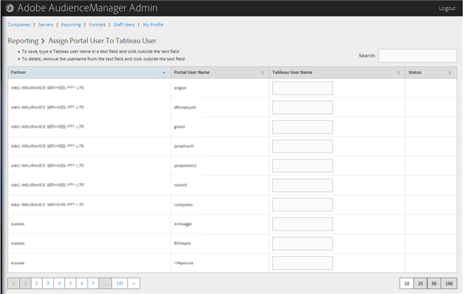

# Assign a Portal User to a Tableau User {#assign-a-portal-user-to-tableau-user}

<!-- t_tabeau.xml -->

使用頁 [!UICONTROL Reporting] 面可讓入口網站使用者成為 [!DNL Tableau] 使用者。 這可讓使用者在Audience [!DNL Tableau] Manager中檢視報表。

1. 按一下 **[!UICONTROL Reporting]** > **[!UICONTROL Assign Portal User to Tableau User]**.

   

1. 若要指派使用者，請在所要的合作夥伴列中，在文字欄 [!DNL Tableau] 位中輸入使用者名稱，然後按一下文字欄位外的。

若要刪除使用者指定，請在所要的合作夥伴列中，從文字欄位移除使用者名稱，然後按一下文字欄位外的。
