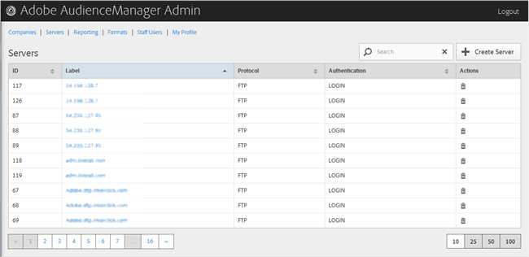

# 伺服器概述 {#servers-overview}

使用[!UICONTROL Servers]頁面可檢視Audience Manager設定中的伺服器清單。 您可以編輯或刪除現有伺服器或建立新伺服器，前提是您已分配了適當的用戶角色。

<!-- c_servers.xml -->

您可以按一下所需欄的標題，以遞增或遞減順序來排序每個欄。 使用[!UICONTROL Search]方塊或清單底部的編頁控制項，以尋找所需的伺服器。