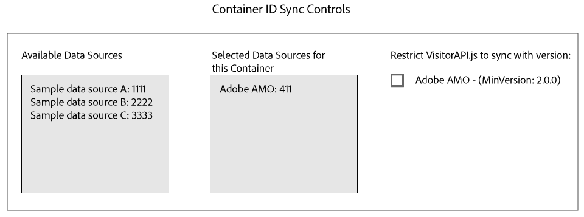

# 與Media Optimizer同步ID同步 {#id-syncing-with-media-optimizer}

依預設，所有公司會同步資料與 [!DNL Adobe Media Optimizer] ([!DNL AMO])。在此 [!UICONTROL Admin UI]中，每個公司容器都有管理此程序的資料來源。此資料來源為 [!UICONTROL Adobe AMO] ([!UICONTROL ID] 411)。按一下選定公司的容器列(位於 [!UICONTROL Containers] 標籤下方)以停用此預設同步，或新增及移除其他資料來源至 [!DNL AMO] 同步程序。

## ID同步狀態 {#id-sync-status}

下表說明資料來源的同步狀態。

| 狀態 | 說明 |
|------ | -------- |
| 關閉 | 從此容器移除所有 [!UICONTROL Selected Data Sources] 資料來源，以停用ID同步與 [!DNL AMO] |
| On(不論ID服務版本) | 在下列情況下 [!DNL AMO] ，不論ID服務版本為何，資料來源同步： <ul><li>資料來源會出現在 [!UICONTROL Selected Data Sources] 清單中。</li><li>[!DNL AMO] 未選取核取方塊 ** 。</li></ul> |
| On(不論ID服務版本) | 在下列情況下，資料 [!DNL AMO] 來源會與ID服務2.0(或更新版本)同步： <ul><li>資料來源會出現在 [!UICONTROL Selected Data Sources] 清單中。</li><li>[!DNL AMO] 選取核取方塊 ** 。</li></ul> |

>[!MORE_贊_ this]
>
>* [管理容器](../companies/admin-manage-containers.md#task_61DB5CEECC5049DD8D059C642AC3F967)

