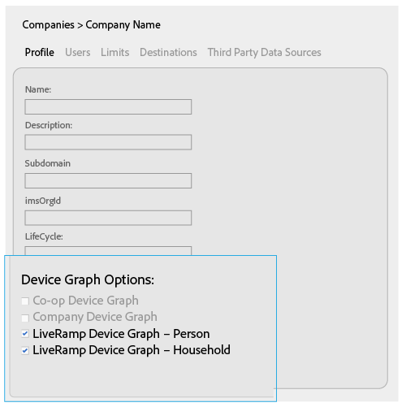
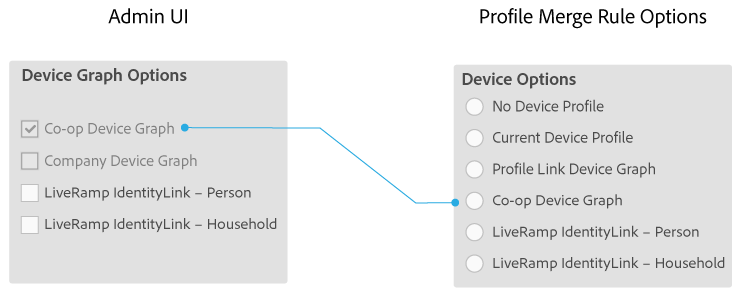
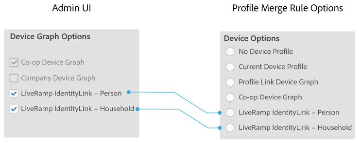

# 適用於公司的裝置圖表選項 {#device-graph-options-for-companies}

參 [!UICONTROL Device Graph Options] 與此計畫的公司可使用 [!DNL Adobe Experience Cloud Device Co-op]。 如果客戶也與與與Audience manager整合的第三方裝置圖形提供者有合約關係，本節將顯示該裝置圖形的選項。 這些選項位於 [!UICONTROL Companies] &gt;公司名稱&gt; [!UICONTROL Profile] &gt; [!UICONTROL Device Graph Options]。

此圖為協力廠商裝置圖形選項使用通用名稱。 在生產中，這些名稱來自裝置圖形提供者，可能與此處顯示的名稱不同。 例如，通常 [!DNL LiveRamp] （但並不總是）有下列選項：

* 請先閱讀 "[!DNL LiveRamp]"
* 包含中間名稱（視情況而定）
* 以"[!UICONTROL - Household]"或"[!UICONTROL -Person]"結尾

## 已定義設備圖形選項 {#device-graph-options-defined}

您在此處選取的裝置圖表選項會顯示或隱 [!UICONTROL Device Options] 藏客戶在建立 [!DNL Audience Manager] 時可用的選項 [!UICONTROL Profile Merge Rule]。

### Co-op裝置圖表 {#co-op-graph}

參與 [Adobe Experience Cloud Device Co-op的客戶可使用這些選項來建立具有確定性](https://marketing.adobe.com/resources/help/en_US/mcdc/) 和概 [!UICONTROL Profile Merge Rule] 率性資料的資料 。 透過 [!DNL Corporate Provisioning Team] 後端呼叫來啟動並停用此選 [!DNL API] 項。 您不能在中選中或清除這些框 [!DNL Admin UI]。 此外，選項 **[!UICONTROL Co-op Device Graph]** 和選 **[!UICONTROL Company Device Graph]** 項互斥。 客戶可以要求我們啟動一個或另一個，但不能同時啟動兩者。 勾選後，這會顯 **[!UICONTROL Co-op Device Graph]** 示設定中 [!UICONTROL Device Options] 的控制項 [!UICONTROL Profile Merge Rule]。

### 公司裝置圖 {#company-graph}

此選項適用於 [!DNL Analytics] 在報表套裝中 [!UICONTROL People] 使用量度 [!DNL Analytics] 的客戶。 透過 [!DNL Corporate Provisioning Team] 後端呼叫來啟動並停用此選 [!DNL API] 項。 您不能在中選中或清除這些框 [!DNL Admin UI]。 此外，選項 **[!UICONTROL Company Device Graph]** 和選 **[!UICONTROL Co-op Device Graph]** 項互斥。 客戶可以要求我們啟動一個或另一個，但不能同時啟動兩者。 勾選時：

* 此裝置圖表使用屬於您所設定公司的確定性資料（無概率資料）。
* [!DNL Audience Manager] 自動建立名 [!UICONTROL Data Source] 為 `*`合作夥伴名稱`*-Company Device Graph-Person`。 在詳細 [!UICONTROL Data Source] 資訊頁面中， [!DNL Audience Manager] 客戶可以變更合作夥伴名稱、說明，並套用「資料匯  出控制」至此資料來源。
* [!DNL Audience Manager] 客戶 *不會在* 「」區段中看到 [!UICONTROL Device Options] 新的設定 [!UICONTROL Profile Merge Rule]。

### LiveRamp裝置圖表（人員或家庭） {#liveramp-device-graph}

當合作夥伴建立並選擇和/ [!DNL Admin UI] 或時，這些複選框 [!UICONTROL Data Source] 將在 **[!UICONTROL Use as an Authenticated Profile]** 中啟用 **[!UICONTROL Use as a Device Graph]**。 這些設定的名稱由協力廠商裝置圖形提供者(例如 [!DNL LiveRamp], [!DNL TapAd]等等)決定。 勾選後，這表示您所設定的公司將使用這些裝置圖表提供的資料。

>[!MORELIKETHIS]
>
>* [定義的配置檔案合併規則選項](https://marketing.adobe.com/resources/help/en_US/aam/merge-rule-definitions.html)
>* [資料來源設定和功能表選項](https://marketing.adobe.com/resources/help/en_US/aam/datasource-settings-definitions.html)

