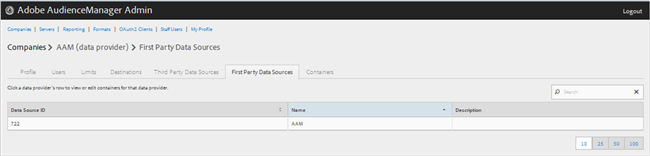
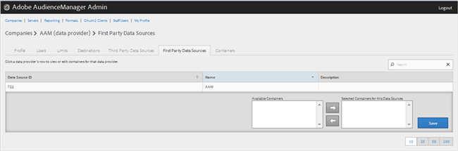

# 管理第一方資料提供者 {#manage-first-party-data-providers}

檢視或編輯第一方資料提供者的容器和對應。

<!-- t_first_party_providers.xml -->

1. 按一 **[!UICONTROL Companies]**&#x200B;下，然後找出並按一下所要的公司以顯示其 [!UICONTROL Profile] 頁面。 使用 [!UICONTROL Search] 清單底部的方塊或分頁控制項，以尋找所需的公司。 您可以按一下所需欄的標題，以遞增或遞減順序來排序每個欄。

1. Click the **[!UICONTROL First Party Data Providers]** tab.

   

1. 按一下資料提供者的列，以檢視或編輯該資料提供者的容器和對應。

   

1. 從清單和清 **[!UICONTROL Available Containers]** 單中移 **[!UICONTROL Selected Containers for This Data Provider]** 動容器，方法是選取所需的容器，然後視需要按一下右箭頭或左箭頭。
1. 如果 **[!UICONTROL Save]** 您進行變更，請按一下。