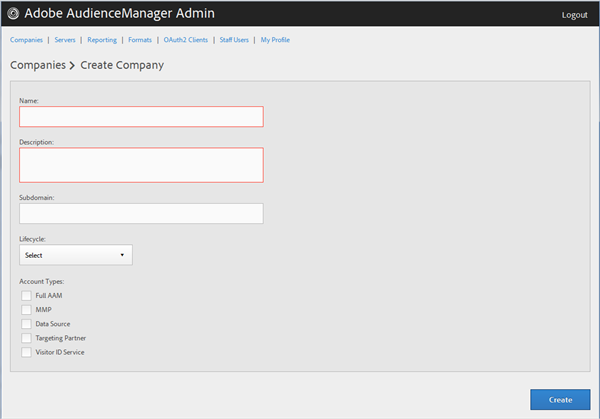
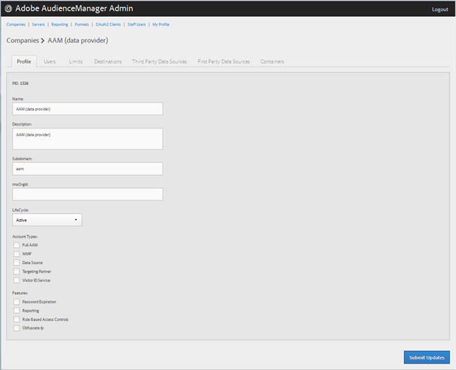
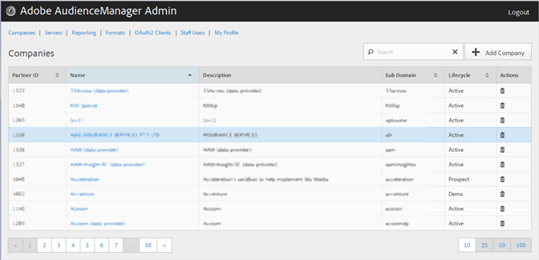

# 建立公司設定檔 {#create-a-company-profile}

使用「 [!UICONTROL Companies] Audience Manager管理」工具中的頁面建立新公司。

<!-- t_create_company.xml -->

>[!NOTE]
>
>您必須具備角 **[!UICONTROL DEXADMIN]** 色才能建立新公司。

1. 按一下 **[!UICONTROL Companies]** > **[!UICONTROL Add Company]**.
1. 填寫欄位: 

   * **[!UICONTROL Name]**: （必要）指定公司名稱。
   * **[!UICONTROL Description]**: （必要）提供有關公司的說明性資訊，例如產業或其完整名稱。
   * **[!UICONTROL Subdomain]**: （必要）指定公司的子網域。 您輸入的文字會顯示為事件呼叫的子網域。 這是無法改變的。 它必須是有效字 [!DNL URL]元的字串。

      例如，如果您的公司被命 [!DNL AcmeCorp]名，子網域就是 [!DNL acmecorp]。

      Audience Manager使用子網域 [!UICONTROL Data Collection Server]做為([!UICONTROL DCS])。 在上一個範例中，如果您公司的完整 [!DNL URL] 名稱 [!UICONTROL DCS] 為 [!DNL acmecorp.demdex.net]。

   * **[!UICONTROL Lifecyle]**: 指定公司的所需階段：
      * **[!UICONTROL Active]**: 指定公司將是作用中的Audience Manager用戶端。 帳 [!UICONTROL Active] 戶是指付費客戶，不僅是諮詢，還是Audience Manager SKU。
      * **[!UICONTROL Demo]**: 指定公司僅供示範之用。 報告資料會自動偽造。
      * **[!UICONTROL Prospect]**: 指定該公司是潛在的Audience Manager客戶，例如為某公司提供免費的 [!DNL POC] 帳戶設定以進行銷售示範。
      * **[!UICONTROL Test]**: 指定公司僅供內部測試之用。
   * **[!UICONTROL Account Types]**: 指定此公司的完整帳戶類型集。 任何帳戶類型都不與任何其他類型互斥。
      * **[!UICONTROL Full AAM]**: 指定公司將擁有完整的Adobe Audience Manager帳戶，而使用者將擁有登入存取權。
      * **[!UICONTROL MMP]**: 指定公司已啟用使用( [!UICONTROL Master Marketing Profile][!UICONTROL MMP])功能。 此 [!UICONTROL MMP] 功能可讓觀眾在Experience Cloud中使用 [!UICONTROL Experience Cloud ID] ([!DNL MCID])來共用觀眾，此()會指派給每個訪客，然後由Audience Manager使用。 如果您選取此帳戶類型， [!UICONTROL Experience Cloud ID Service] 也會自動選取。

         如需詳細資訊，請參 [閱「觀眾服務——主行銷設定檔」](https://marketing.adobe.com/resources/help/en_US/mcloud/audience_library.html)。
   * **[!UICONTROL Data Source]**: 指定公司是Audience Manager中的第三方資料提供者。
   * **[!UICONTROL Targeting Partner]**: 指定該公司作為Audience Manager客戶的定位平台。
   * **[!UICONTROL Visitor ID Service]**: 指定公司已啟用使用 [!UICONTROL Experience Cloud Visitor ID Service]。

      提供 [!UICONTROL Experience Cloud Visitor ID Service] 跨Experience Cloud解決方案的通用訪客ID。 For more information, see the [Experience Cloud Visitor ID Service user guide](https://marketing.adobe.com/resources/help/en_US/mcvid/mcvid-overview.html).

   * **[!UICONTROL Agency]**: 指定公司將擁有帳 [!UICONTROL Agency] 戶。

1. 按一下 **[!UICONTROL Create]**. 繼續「編輯公司設 [定檔」中的指示](../companies/admin-manage-company-profiles.md#edit-company-profile)。

   

## 編輯公司設定檔{#edit-company-profile}

編輯公司的描述檔，包括其名稱、說明、子網域、生命週期等。

<!-- t_edit_company_profile.xml -->

1. 按一 **[!UICONTROL Companies]**&#x200B;下，然後找出並按一下所要的公司以顯示其 [!UICONTROL Profile] 頁面。

   使用 [!UICONTROL Search] 清單底部的方塊或分頁控制項，以尋找所需的公司。 您可以按一下所需欄的標題，以遞增或遞減順序來排序每個欄。

   

1. 視需要編輯欄位:

   * **[!UICONTROL Name]**: 編輯公司名稱。 這是必填欄位。
   * **[!UICONTROL Description]**: 編輯公司的說明。 這是必填欄位。
   * **[!UICONTROL Subdomain]**: （必要）指定公司的子網域。 您輸入的文字會顯示為事件呼叫的子網域。 這是無法改變的。 它必須是有效字 [!DNL URL]元的字串。

      例如，如果您的公司被命 [!DNL AcmeCorp]名，子網域就是 [!DNL acmecorp]。

      Audience Manager使用子網域 [!UICONTROL Data Collection Server] 做為([!UICONTROL DCS])。 在上一個範例中，如果您公司的完整 [!DNL URL] 名稱 [!UICONTROL DCS] 為 [!DNL acmecorp.demdex.net]。

   * **[!UICONTROL imsOrgld]**: ([!UICONTROL Identity Management System Organization ID])此ID可讓您連接公司與Adobe Experience Cloud。
   * **[!UICONTROL Lifecyle]**: 指定公司的所需階段：
      * **[!UICONTROL Active]**: 指定公司將是作用中的Audience Manager用戶端。 「作用中」帳戶是指付費客戶，不僅是諮詢客戶，還是Audience Manager SKU。
      * **[!UICONTROL Demo]**: 指定公司僅供示範之用。 報告資料會自動偽造。
      * **[!UICONTROL Prospect]**: 指定該公司是潛在的Audience Manager客戶，例如為某公司提供免費的 [!DNL POC] 帳戶設定以進行銷售示範。
      * **[!UICONTROL Test]**: 指定公司僅供內部測試之用。
   * **[!UICONTROL Account Types]**: 指定此公司的完整帳戶類型集。 任何帳戶類型都不與任何其他類型互斥。
      * **[!UICONTROL Full AAM]**: 指定公司將擁有完整的Adobe Audience Manager帳戶，而使用者將擁有登入存取權。
      * **[!UICONTROL MMP]**: 指定公司已啟用主行銷設定檔([!UICONTROL MMP])功能。

         如果您選取此帳戶類型， **[!UICONTROL Visitor ID Service]** 也會自動選取。
如需詳細資訊，請參 [閱「觀眾服務——主行銷設定檔」](https://marketing.adobe.com/resources/help/en_US/mcloud/audience_library.html)。
   * **[!UICONTROL Data Source]**: 指定公司是Audience Manager中的第三方資料提供者。
   * **[!UICONTROL Targeting Partner]**: 指定該公司作為Audience Manager客戶的定位平台。
   * **[!UICONTROL Visitor ID Service]**: 指定公司已啟用使用Experience Cloud訪客ID服務。

      Experience Cloud 訪客 ID 服務提供跨 Experience Cloud 解決方案的通用訪客 ID。For more information, see the [Experience Cloud Visitor ID Service user guide](https://microsite.omniture.com/t2/help/en_US/mcvid/mcvid_service.html).

   * **[!UICONTROL Agency]**: 指定公司將擁有代理帳戶。
   * **[!UICONTROL Features]**: 選擇所要的選項:
      * **[!UICONTROL Password Expiration]**: 將此公司內的所有使用者密碼設為在90天後過期，以提高Audience Manager的安全性。
      * **[!UICONTROL Reporting]**: 啟用此公司的Audience Manager報告。
      * **[!UICONTROL Role Based Access Controls]**: 為此公司啟用基於角色的訪問控制。 基於角色的訪問控制可讓您建立具有不同訪問權限的用戶組。 然後，這些群組中的個別使用者只能存取Audience Manager中的特定功能。

1. 按一下 **[!UICONTROL Submit Updates]**.

## 刪除公司個人資料 {#delete-company-profile}

使用Audience [!UICONTROL Companies] Manager工具中的頁 [!UICONTROL Admin] 面刪除現有公司。

<!-- t_delete_company.xml -->

>[!NOTE]
>
>您必須具有 [!UICONTROL DEXADMIN] 角色，才能刪除現有公司。

1. 若要刪除現有公司，請按一下 **[!UICONTROL Companies]**。

   

1. 按一  下所 **[!UICONTROL Actions]** 要公司的欄位。
1. Click **[!UICONTROL OK]** to confirm the deletion.
