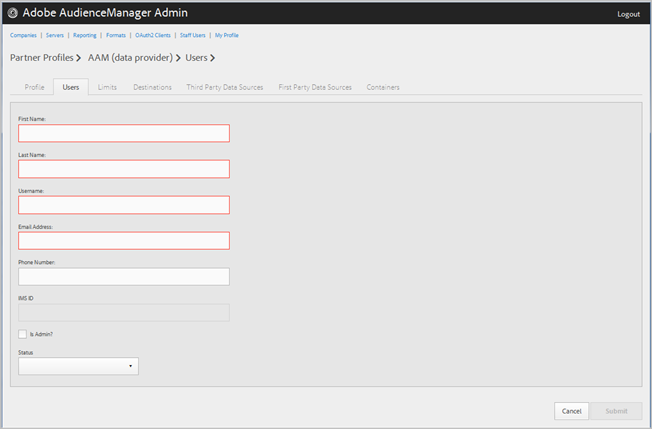

# 管理公司使用者 {#manage-company-users}

建立新的Audience Manager使用者，或編輯和刪除現有使用者。

<!-- t_manage_company_users.xml -->

1. 按一下 **[!UICONTROL Companies]**，然後找出並按一下所需的公司以顯示其 [!UICONTROL Profile] 頁面。

   使用 [!UICONTROL Search] 方塊底部或清單底部的分頁控制項來尋找所需的公司。您可以按一下所要的欄標題，以遞增或遞減順序排序每欄。
1. Click the **[!UICONTROL Users]** tab.
1. 若要建立新使用者，請按 **[!UICONTROL Create a New User]**&#x200B;一下。若要編輯現有使用者，請找出並按一下所要的使用者 **[!UICONTROL Username]** 欄。

   

1. 填寫欄位: 

   * **[!UICONTROL First Name]**：(必要)指定使用者的名字。
   * **[!UICONTROL Last Name]**：(必要)指定使用者的姓氏。
   * **[!UICONTROL Username]**：(必要)指定使用者的Audience Manager使用者名稱。使用者名稱必須是唯一的。
   * **[!UICONTROL Email Address]**：(必要)指定使用者的電子郵件地址。
   * **[!UICONTROL Phone Number]**：指定使用者的電話號碼。
   * **[!UICONTROL IMS ID]**： [!UICONTROL Identity Management System ID]使用者的檔案。此ID可讓使用者連結至Adobe Experience Cloud的Adobe解決方案。
   * **[!UICONTROL Is Admin]**：讓此使用者成為Audience Manager管理使用者。管理員擁有此合作夥伴的所有Audience Manager使用者角色。
   * **[!UICONTROL Status]**：建立新使用者時，此欄位一開始會顯示， **[!UICONTROL Pending]** 直到使用者登入並重設暫存密碼為止。如果您要編輯現有使用者，可以從下列狀態中選取：
      * **[!UICONTROL Active]**：指定此使用者為作用中Audience Manager使用者。
      * **[!UICONTROL Deactivated]**：指定此使用者為已停用的Audience Manager使用者。
      * **[!UICONTROL Expired]**：指定此使用者已過期。
      * **[!UICONTROL Locked Out]**：指定此使用者為已鎖定的使用者。

1. Click **[!UICONTROL Submit]**.

## 刪除使用者 {#delete-user}

若要刪除使用者：

1. 按一下 **[!UICONTROL Companies]**，找到並按一下所需的公司，然後按一下 **[!UICONTROL Users]** 標籤。
1. 按一下  所需使用者 **[!UICONTROL Actions]** 的欄。
1. Click **[!UICONTROL OK]** to confirm the deletion.