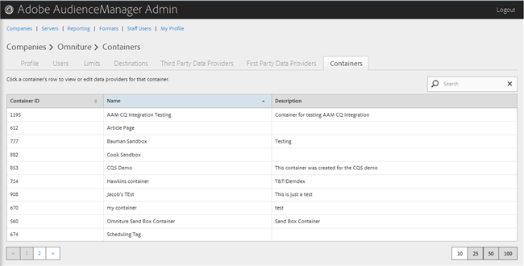
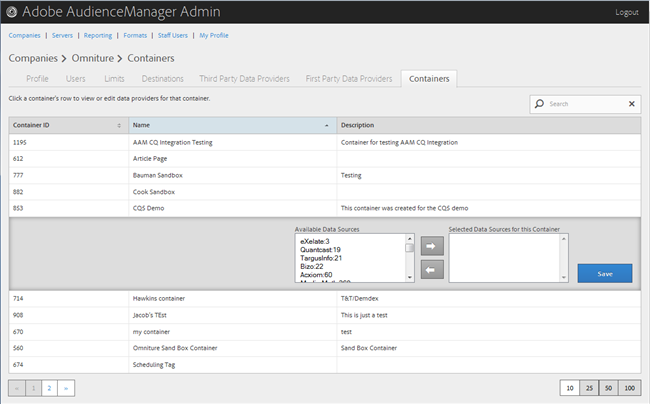

# 管理容器 {#manage-containers}

檢視或編輯容器的資料提供者。

<!-- t_containers.xml -->

>[!NOTE]
>
>依預設，公司會建立一個容器。 您可以在使用者介面中為公司建立其他容器，位置如下： **[!UICONTROL Tools > Tags]**.

1. 按一下 **[!UICONTROL Companies]**，然後找到並按一下所需的公司以顯示其 [!UICONTROL Profile] 頁面。

   使用 [!UICONTROL Search] 方塊或清單底部的分頁控制項，以尋找所需的公司。 您可以按一下所需欄的標頭，以遞增或遞減順序排序每個欄。

1. 按一下 **[!UICONTROL Containers]** 標籤。

   

1. 按一下容器的列，即可檢視或編輯該容器的資料提供者。

   

1. 將資料來源從 **[!UICONTROL Available Data Sources]** 和 **[!UICONTROL Selected Data Sources for This Container]** 清單，方法是選取所需的資料來源，然後視需要按一下向右或向左箭頭。

   您也可以從以下位置執行此工作 [第三方資料提供者](../companies/admin-third-party-providers.md#task_E942DD674D794BA6B8EFD52FD866E689)頁面。

1. 按一下 **[!UICONTROL Save]** 若您進行變更。

>[!MORELIKETHIS]
>
>* [與 Media Optimizer 同步的 ID](../companies/admin-amo-sync.md#concept_2B5537233DAA4860B3503B344F937D83)

