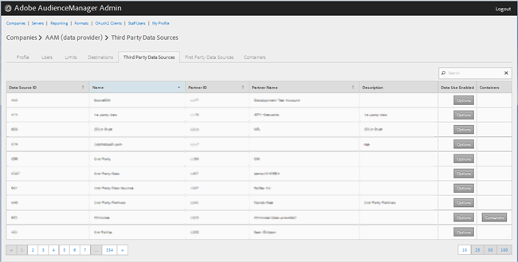
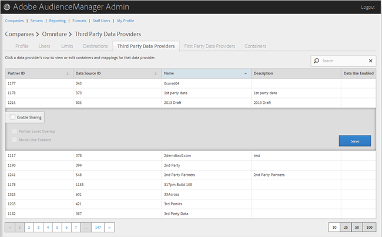

# 管理第三方資料供應商 {#manage-third-party-data-providers}

檢視或編輯第三方資料供應商的容器和對應。您也可以與不同的資料供應商共用共用。

1. 按一下 **[!UICONTROL Companies]**，然後找出並按一下所需的公司以顯示其 [!UICONTROL Profile] 頁面。

   使用 [!UICONTROL Search] 方塊底部或清單底部的分頁控制項來尋找所需的公司。您可以按一下所要的欄標題，以遞增或遞減順序排序每欄。
1. Click the **[!UICONTROL Third Party Data Providers]** tab.

   

1. 按一下資料提供者的列，檢視或編輯該資料提供者的容器和對應。

   

1. 選取 **[!UICONTROL Enable Sharing]** 以啓用下列選項：

   * **合作夥伴層級重疊：**
   * **啓用模型：** 可讓此公司在建立演算法模型時使用此資料提供者。
   啓用共用時，您可以存取此資料提供者的特性。

1. (條件性)如果容器已啓用，您可以將所需容器從可用清單移至所選清單，為此資料提供者選取容器。

   您也可以從 [「容器」](../companies/admin-manage-containers.md#task_61DB5CEECC5049DD8D059C642AC3F967) 頁面執行此任務。
1. 如果 **[!UICONTROL Save]** 您進行了變更，請按一下。