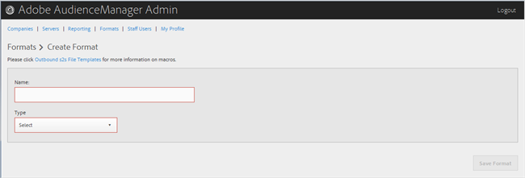

# 建立或編輯格式 {#create-or-edit-a-format}

使用「Audience Manager管理工具」中的[!UICONTROL Formats]頁面建立新格式或編輯現有格式。

<!-- t_create_format.xml -->

>[!TIP]
>
>為外界資料選擇格式時，最好（如果可能）重新使用現有格式。 使用已驗證的格式，可確保成功產生傳出資料。 若要確切查看現有格式的格式，請按一下菜單欄中的[!UICONTROL Formats]選項，然後按名稱或ID號搜索格式。 格式中使用的格式錯誤或宏將提供格式錯誤的輸出，或將阻止完全輸出資訊。

1. 要建立新格式，請按一下「**[!UICONTROL Formats]** > **[!UICONTROL Add Format]**」。 若要編輯現有格式，請在&#x200B;**[!UICONTROL Name]**&#x200B;欄中按一下所需的格式。

   

1. 填寫欄位: 
   * **名稱：** （必要）提供格式的描述性名稱。
   * **類型：** （必要）選取所需格式：
      * **[!UICONTROL File]**:透過檔案傳 [!DNL FTP] 送資料。
      * **[!UICONTROL HTTP]**:將資料封裝在包裝 [!DNL JSON] 器中。

1. （條件性）如果您選擇&#x200B;**[!UICONTROL File]**，請填入下列欄位：

   >[!NOTE]
   >
   >有關可用宏的清單，請參閱[檔案格式宏](../formats/file-formats.md#concept_A867101505074418A58DE325949E5089)和[HTTP格式宏](../formats/web-formats.md#reference_C392124A5F3F42E49F8AADDBA601ADFE)。

   * **[!UICONTROL File Name]:** 指定資料傳輸檔案的檔案名稱。
   * **標題：** 指定資料傳輸檔案第一列中顯示的文字。
   * **[!UICONTROL Data Row]:** 指定檔案中每個外界行中顯示的文字。
   * **[!UICONTROL Maximum File Size (In MB)]:** 指定資料傳輸檔案的檔案大小上限。壓縮檔案必須小於100 MB。 未壓縮檔案大小沒有限制。
   * **[!UICONTROL Compression]:** 選取所需的壓縮類型：gz或zip。若要傳送至[!UICONTROL AWS S3]，您必須使用.gz或未壓縮的檔案。
   * **[!UICONTROL .info Receipt]:** 指定會產生傳輸控制([!DNL .info])檔案。[!DNL .info]檔案提供有關檔案傳輸的元資料資訊，以便合作夥伴能夠驗證Audience Manager已正確處理的檔案傳輸。 如需詳細資訊，請參閱記錄檔傳輸的[傳輸控制檔案](https://experienceleague.adobe.com/docs/audience-manager/user-guide/implementation-integration-guides/receiving-audience-data/batch-outbound-data-transfers/transfer-control-files.html?lang=en)。
   * **[!UICONTROL MD5 Checksum Receipt]:** 指定生成 [!DNL MD5] 校驗和接收。[!DNL MD5]校驗和接收，以便合作夥伴可以驗證Audience Manager是否正確處理完全傳輸。

1. （條件性）如果您選擇&#x200B;**[!UICONTROL HTTP]**，請填入下列欄位：

   * **[!UICONTROL Method]:** 選擇要 [!DNL API] 用於轉移流程的方法：
      * **[!UICONTROL POST]:** 如果您選 [!DNL POST]取，請選取內容類型([!DNL XML] 或 [!DNL JSON])，然後指定請求內文。
      * **[!UICONTROL GET]:** 如果您選取 [!DNL GET]，請指定查詢參數。

1. 如果要建立新格式，請按一下&#x200B;**[!UICONTROL Create]**；如果要編輯現有格式，請按一下&#x200B;**[!UICONTROL Save Updates]**。

## 刪除格式 {#delete-format}

1. 按一下 **[!UICONTROL Formats]**.
2. 按一下所需格式&#x200B;**[!UICONTROL Actions]**&#x200B;欄中的 。
3. 按一下&#x200B;**[!UICONTROL OK]**&#x200B;以確認刪除。
