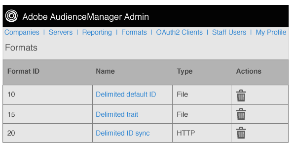

# 格式概述 {#formats-overview}

格式是已儲存的範本（或檔案），使用巨集來組織傳送至目的地的資料內容。 格式型別包括 [!DNL HTTP] 格式和檔案格式。 [!DNL HTTP] 格式傳送資料於 [!DNL JSON] 物件 [!DNL POST] 或 [!DNL GET] 方法。 檔案格式透過以下方式在檔案中傳送資料 [!DNL FTP]. 每種格式使用的巨集可讓您設定檔案名稱、定義檔案標頭及組織資料檔案的內容。 在管理員中 [!DNL UI]，您可以在設定客戶的目的地時建立、儲存和重複使用格式。

